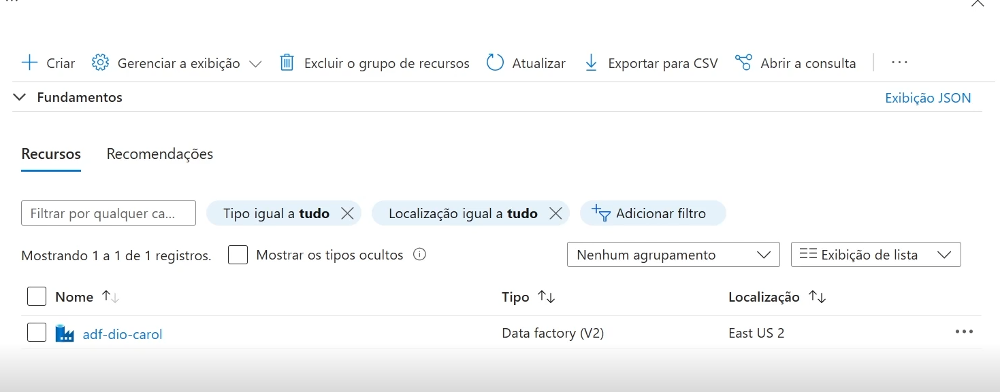
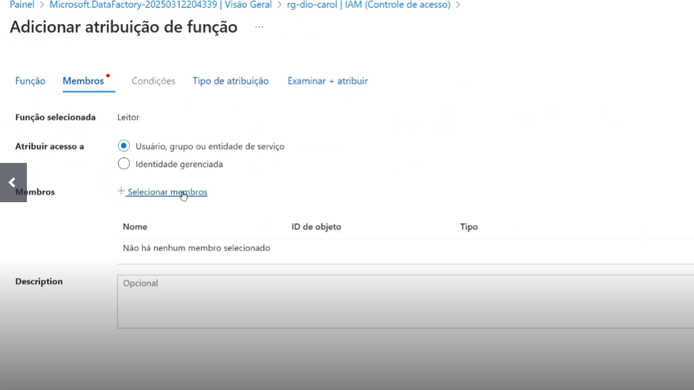
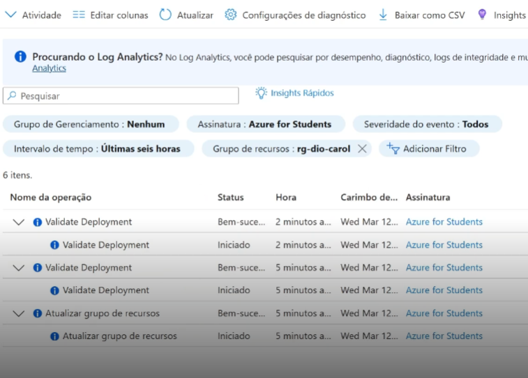

# Projeto: Criação de Recurso no Azure com Atribuição de Funções e Criando um Monitoramento de Custos no Data Factory

## 📋 Descrição

Este projeto consiste na criação de um recurso no Microsoft Azure, configuração de permissões através de atribuições de função, e verificação do funcionamento via logs.  
O objetivo principal foi entender o fluxo de criação, segurança e monitoramento de recursos na nuvem.

---

## 🛠️ Processo Realizado

### 1. Criação do Recurso no Azure
- Iniciei a criação do recurso através do portal do Azure.
- Escolhi o tipo de recurso adequado e configurei os parâmetros básicos como nome, região e grupo de recursos.
  
**Print:** 

---

### 2. Atribuição de Funções (IAM - Identity and Access Management)
- Realizei a atribuição de funções para conceder as permissões corretas ao recurso.
- Escolhi a função necessária (por exemplo: *Contribuidor*, *Leitor*, *Administrador*).
- Atribuí a função a usuários ou grupos específicos.

**Print:** 

---

### 3. Verificação via Logs
- Após a criação e configuração, acessei a área de **Monitoramento** para visualizar os logs.
- Validei que o recurso foi criado e que as ações realizadas estavam registradas corretamente.

**Print:** 

---

## 💡 Insights Aprendidos

- A importância de atribuir funções com o princípio do menor privilégio (evitando excessos de permissão).
- O Azure registra toda movimentação no recurso, o que facilita auditorias futuras.
- É possível automatizar essas atribuições usando scripts em ARM, Bicep ou Terraform.
- A navegação no portal do Azure é bem intuitiva, mas para projetos maiores a automação via linha de comando (CLI) ou DevOps pode ser muito útil.

---

## 🚀 Possibilidades Futuras

- Criar políticas automáticas de atribuição de funções (Role-Based Access Control - RBAC) para grandes ambientes.
- Automatizar a criação de recursos e permissões com Azure DevOps pipelines.
- Utilizar templates de infraestrutura como código (IaC) para padronizar a criação de ambientes.

---

